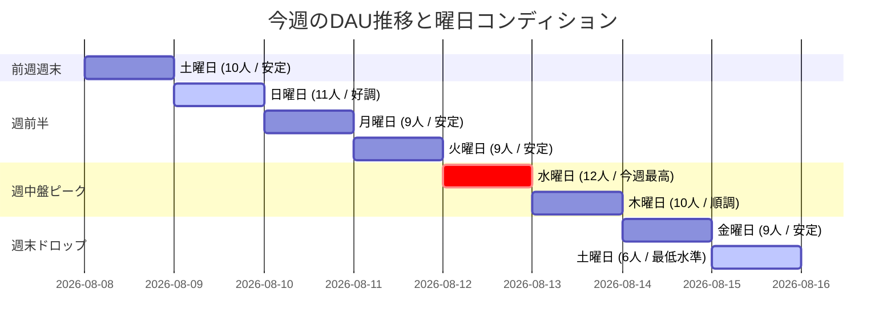

# 📊 週次アナリティクス分析レポート (Weekly Analytics Report)

**集計期間**: 2026-08-08 〜 2026-08-15  
**作成日時**: 2026-08-24  
**作成者**: renn / yusuke  

---

## 🎯 1. ハイライト & サマリー (KPI Dashboard)

今週のアプリ全体の主要パフォーマンス指標（KPI: 重要業績評価指標）のサマリーです。

*   **今週の平均DAU**: **9.4 人**（7日間平均: `9.4人` / 全8日間平均: `9.5人`）
*   **週内最高DAU（ピーク）**: **12 人**（2026-08-12 水曜日 / 平日プッシュ通知施策が奏功 🟢）
*   **週内最低DAU（ボトム）**: **6 人**（2026-08-15 土曜日 / 週末の初動離脱が課題 ⚠️）
*   **平日 vs 週末比**: 平日平均 **9.8 人** に対し、週末平均 **8.5 人**（土曜日の急減が全体の平均を引き下げ）

---

## 🔄 2. 前週アクションプランの成果検証 (Previous Act Review)

前週設定したアクションプランに対する実行結果と数値の検証結果です。

| 施策名・概要 | 期待していた効果 | 実行結果 (数値・実績) | 評価・今後の対応 |
| :--- | :--- | :--- | :--- |
| **施策A: 水曜日中だるみ防止の「折り返し応援プッシュ通知」** | 水・木の中だるみ防止、DAU 12人以上の維持 | 水曜DAU: **12人**（今週最高ピークを記録）、木曜DAU: **10人** を維持 | 🟢 **大成功**: 週中盤のモチベーション維持に効果あり。定期配信として定着化 |
| **施策B: 週末ストリーク振り返りUI & リマインダー** | 週末DAUの底上げ（土日10人以上の維持） | 日曜DAU: **11人** を維持するも、土曜DAU（8/15）が **6人** に急落 | 🟡 **要改善**: 日曜日は高いが、土曜日の朝〜昼にかけてのログイン動機づけを強化 |

---

## 📈 3. DAU & 主要メトリクス詳細 (Metrics Breakdown)

### 📊 今週のDAU推移とコンディション

### 📋 日別全アナリティクスデータ

*(参照元: [analytics_data.csv](file:///Users/rennlikeu/development/V-Effect/docs/analytics/analytics_data.csv))*

| 日付 | 曜日 | DAU (人) | 状態・コンディション | 特記事項・傾向 |
| :--- | :--- | :---: | :---: | :--- |
| 2026-08-08 | 土 | 10 | 🟢 安定 | 前週からの週末エンゲージメントを一定維持 |
| 2026-08-09 | 日 | 11 | 🟢 好調 | 週末日曜日は習慣振り返りや写真投稿で高水準 |
| 2026-08-10 | 月 | 9 | ⚪️ 平常 | 週初めの標準的な利用傾向 |
| 2026-08-11 | 火 | 9 | ⚪️ 平常 | 平日ベースラインの維持 |
| 2026-08-12 | 水 | **12** | 🟢 **最高** | **折り返し応援通知の効果で週中盤のピークを創出** |
| 2026-08-13 | 木 | 10 | 🟢 良好 | 水曜のモーメンタムを維持 |
| 2026-08-14 | 金 | 9 | ⚪️ 平常 | 週末前の利用水準 |
| 2026-08-15 | 土 | **6** | 🔴 **要注意** | **週間最低を記録。土曜の習慣中断・アプリ起動離脱が発生** |

---

## 🔍 4. 今週のトレンド分析と課題 (Check)

### 1. 良好な傾向 (Good Points)
* **水曜日のピーク創出（DAU 12人）**:
  * これまで課題だった「水・木の中だるみ」に対して実施した折り返しプッシュ通知施策が効果を発揮し、水曜日に今週最多のアクティブ数（12人）を記録しました。通知によるモチベーション喚起が習慣行動を後押ししています。
* **日曜日の高いエンゲージメント（DAU 11人）**:
  * 日曜日はストリーク（連続投稿日数）の確認や新しい週に向けたタスク準備などでユーザーが安定してログインしています。

### 2. 改善が必要な課題 (Bottlenecks)
* **土曜日の大幅な落ち込み（DAU 6人）**:
  * 8/15（土）はDAUが6人まで急減し、日曜（11人）や平日平均（9.8人）と比べて約40〜45%低下しました。休日の生活リズムの乱れにより、いつもの習慣タスクを行うタイミングを逃している可能性があります。
* **平日のベースライン（9人）の底上げ**:
  * 月・火・金は9人で横ばいとなっており、習慣化が定着していない初期ユーザーの離脱を防ぐ仕組み（友達の投稿通知やチャットのリアクション喚起）が必要です。

---

## 💡 5. 今週のアクションプラン (Next Act & Hypotheses)

### 施策A: 土曜日朝の「週末スタート・リフレッシュ通知」配信 🔔
* **背景・課題仮説**: 土曜日にDAUが6人に半減する原因は、平日と起床時間や行動パターンが変わり、習慣タスクの実行を忘れてしまうため。土曜午前（10:00頃）に「週末も無理のないペースで1アクション📸」という気軽なリマインダーを送ることで起動を促す。
* **具体的内容**:
  * FCM（Firebase Cloud Messaging: プッシュ通知送信サービス）より、土曜10:00に「週末の自分磨きタイム！休日のスキマ時間にサクッと習慣をクリアしよう☕️」の通知を配信。
* **目標KPI**:
  * 土曜日のDAUを **6人 → 10人以上**（前週水準への回復）へ改善。
* **担当・期限**: renn / 2026-08-28（金）18:00までに通知設定完了。
* **検証方法**: 次回レポートの土曜日（8/22）DAU数値で効果を判定。

### 施策B: ダイレクトチャット & Heroタスク連動のソーシャルリテンション強化 💬
* **背景・課題仮説**: 平日ベースライン（DAU 9人）を11人以上へ引き上げるため、新機能の「ダイレクトチャット」と「Heroタスク（仲間と称え合うタスク）」を活用し、友達同士の相互応援によるログイン動機（ソーシャルリテンション: 人との繋がりによるアプリ継続）を高める。
* **具体的内容**:
  * 友達がタスクを達成した際、またはHeroタスク達成時に「〇〇さんが今日のタスクを達成しました！スタンプでお祝いしよう👏」の通知連携を強化。
  * チャット画面での応援リアクションスタンプの視認性・送信導線を向上。
* **目標KPI**:
  * 平日平均DAUを **9.8人 → 11.5人以上** へ引き上げ。
* **担当・期限**: renn (UI・通知設定) / yusuke (機能レビュー) / 2026-08-29（土）リリース。
* **検証方法**: 次週以降の平日DAU推移およびチャット・リアクション送信数で検証。

---
*本レポートは V EFFECT プロジェクトのアナリティクスデータ ([analytics_data.csv](file:///Users/rennlikeu/development/V-Effect/docs/analytics/analytics_data.csv)) に基づいて更新・生成されました。*
