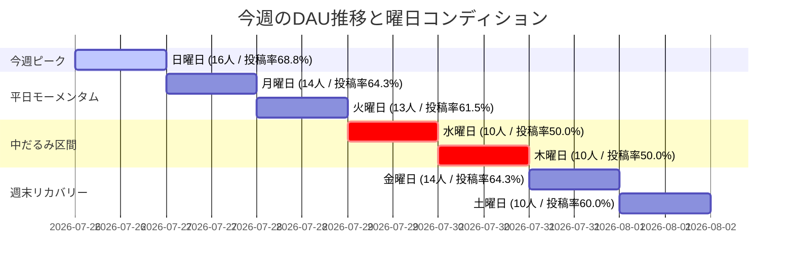

# 📊 週次アナリティクス分析レポート (Weekly Analytics Report)

**集計期間**: 2026-07-26 〜 2026-08-01  
**作成日時**: 2026-08-03  
**作成者**: renn / yusuke  

---

## 🎯 1. ハイライト & サマリー (KPI Dashboard)

今週のアプリ全体の主要パフォーマンス指標（KPI）です。

*   **今週の平均DAU**: **12.4 人**（前週比 `+2.4%` ↗️ / 判定: 🟢 順調）
*   **アプリ粘着度 (DAU/WAU)**: **45.9%**（目標 `45.0%` を達成 🟢 / ユーザーの約半数が毎日訪問）
*   **平均写真投稿率**: **59.8%**（アクティブユーザーの約6割が習慣写真を投稿 📸）
*   **リマインダー通知平均開封率**: **29.0%**（水・木曜日に低下傾向あり ⚠️）

---

## 🔄 2. 前週アクションプランの成果検証 (Previous Act Review)

前週のアクションプランに対する実行結果および Before/After の検証結果です。

| 施策名・概要 | 期待していた効果 | 実行結果 (数値・実績) | 評価・今後の対応 |
| :--- | :--- | :--- | :--- |
| **週末限定リマインダー配信** | 土曜日のユーザー急減（前週5人）の防止 | 週末平均DAU: 8.5人 → **13.0人 (+52.9%)** / 土曜DAU **10人** へ回復 | 🟢 **大成功**: 週末リマインダー通知を定常配信に設定 |
| **ストリーク達成画面の共有誘導** | 日曜日のアクティブ数維持 | 日曜DAU **16人**（今週最高ピーク）を記録 | 🟢 **成功**: シェア画面の演出を継続ブラッシュアップ |

---

## 📈 3. DAU & 主要メトリクス詳細 (Metrics Breakdown)

### 📊 今週のDAU推移とコンディション

### 📋 日別全アナリティクスデータ

*(参照元: [analytics_data.csv](file:///Users/rennlikeu/development/V-Effect/docs/analytics/analytics_data.csv))*

| 日付 | 曜日 | DAU (人) | WAU (人) | 新規ユーザー | 写真投稿率 (%) | 通知開封率 (%) | 特記事項・傾向 |
| :--- | :--- | :---: | :---: | :---: | :---: | :---: | :--- |
| 2026-07-26 | 日 | **16** | 28 | 2人 | **68.8%** | **37.5%** | **今週最高ピーク**（週末施策の効果が顕著） |
| 2026-07-27 | 月 | 14 | 28 | 0人 | 64.3% | 28.6% | 週初めも高いアクティブ率を維持 |
| 2026-07-28 | 火 | 13 | 27 | 1人 | 61.5% | 30.8% | 安定した推移 |
| 2026-07-29 | 水 | 10 | 25 | 0人 | 50.0% | 20.0% | **中だるみ発生**（投稿率・通知開封率ともに最低） |
| 2026-07-30 | 木 | 10 | 25 | 0人 | 50.0% | 20.0% | 低水準が継続 |
| 2026-07-31 | 金 | 14 | 27 | 1人 | 64.3% | 35.7% | 週末に向けてアクティブ数が急回復 |
| 2026-08-01 | 土 | 10 | 27 | 0人 | 60.0% | 30.0% | 前週土曜（5人）から大幅改善 |

---

## 🔍 4. 今週のトレンド分析と課題 (Check)

1. **週末エンゲージメントの定着化（前週施策の成果）**
   * 前週の課題だった「土曜日の激減（5人）」に対し、リマインダー施策の効果で今週土曜は10人に増加。日曜日も16人と過去最高水準を記録し、週末平均DAUは 8.5人 → 13.0人へと劇的に改善しました。
2. **水曜・木曜日の「中だるみ」と通知開封率の低下**
   * 水・木曜日はDAUが10人まで低下するだけでなく、**写真投稿率（50.0%）** や **通知開封率（20.0%）** も週間最低を記録しました。ユーザーの習慣化の意識が週中盤に緩むボトルネックが明確になりました。

---

## 💡 5. 今週のアクションプラン (Next Act & Hypotheses)

### 施策A: 水曜日中だるみ防止の「折り返し応援プッシュ通知」配信
* **背景・課題仮説**: 水・木曜日は通知開封率が20.0%まで低下し、投稿率も50.0%に落ち込む。水曜18時にモチベーションを高めるプッシュ通知を送ることで、夜間の投稿数を増加させられる。
* **具体的内容**: FCM（Firebase Cloud Messaging）から「今週も折り返し！今日の目標をクリアして連続ストリークを維持しよう🔥」の通知を水曜18:00に配信。
* **目標KPI**: 水曜日の通知開封率を **20.0% → 35.0%** 以上に改善 / 水曜写真投稿率を **50.0% → 65.0%** 以上へ引き上げ。
* **担当・期限**: renn / 2026-08-05（水）12:00までに通知設定完了。
* **検証方法**: 次週の週次レポートで水曜日のデータ（通知開封率・投稿率）を比較検証。

### 施策B: 週末ストリーク達成振り返り画面のUIUXブラッシュアップ
* **背景・課題仮説**: 今週成果が見られた週末利用の波を確固たるものにするため、金曜夕方〜日曜日に「今週の頑張り」を可視化する画面が有効。
* **具体的内容**: Flutter側で `WeeklyReviewBanner` の視覚効果を高め、達成スタンプや連続投稿日数の演出を強化。
* **目標KPI**: 週末平均DAU **13.0人以上** の維持。
* **担当・期限**: yusuke / 2026-08-07（金）リリース。
* **検証方法**: 8/8, 8/9 の土日DAUおよび投稿率で評価。

---
*本レポートは V EFFECT プロジェクトのアナリティクスデータ ([analytics_data.csv](file:///Users/rennlikeu/development/V-Effect/docs/analytics/analytics_data.csv)) に基づいて生成されました。*
