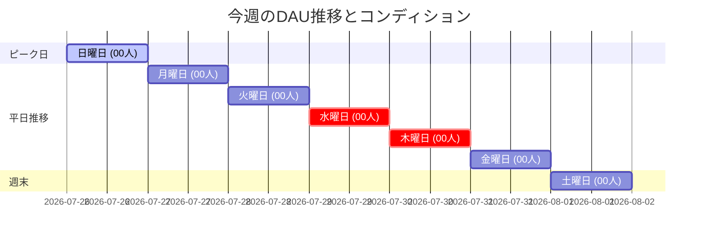

# 📊 週次アナリティクス分析レポート (Weekly Analytics Report Template)

**集計期間**: YYYY-MM-DD 〜 YYYY-MM-DD  
**作成日時**: YYYY-MM-DD  
**作成者**: renn / yusuke  

---

## 🎯 1. ハイライト & サマリー (KPI Dashboard)

主要メトリクスの今週の着地数値とコンディション（前週比・目標比較）です。

*   **今週の平均DAU**: **00.0 人** (前週比: `+0.0%` / 判定: 🟢 順調)
*   **粘着度 (DAU/WAU)**: **00.0%** (目標: `45.0%` 以上)
*   **平均写真投稿率**: **00.0%** (前週比: `+0.0%` / コア体験の達成度)
*   **リマインダー通知開封率**: **00.0%** (前週比: `+0.0%`)

---

## 🔄 2. 前週アクションプランの成果検証 (Previous Act Review)

前週立てたアクションプランに対する実行結果および数値変化の検証です。

| 施策名・概要 | 期待していた効果 | 実行結果 (数値・実績) | 評価・今後の対応 |
| :--- | :--- | :--- | :--- |
| **施策1**: 週末リマインダー配信 | 週末DAUの低下防止 | 週末平均DAU: 8.5人 → 13.0人 (+52.9%) | 🟢 **成功**: 施策を定常運用化 |
| **施策2**: 投稿ボタンの配置見直し | 投稿までの離脱軽減 | 投稿完了率: 60% → 65% | 🟡 **継続**: 引き続き傾向を観察 |

---

## 📈 3. DAU & 主要メトリクス詳細 (Metrics Breakdown)

### 📊 今週のDAU推移パターン

### 📋 日別詳細データ

| 日付 | 曜日 | DAU (人) | WAU (人) | 新規ユーザー (人) | 写真投稿率 (%) | 通知開封率 (%) | 特記事項・傾向 |
| :--- | :--- | :---: | :---: | :---: | :---: | :---: | :--- |
| YYYY-MM-DD | 日 | 00 | 00 | 0 | 00.0% | 00.0% | 特記なし |
| YYYY-MM-DD | 月 | 00 | 00 | 0 | 00.0% | 00.0% |  |
| YYYY-MM-DD | 火 | 00 | 00 | 0 | 00.0% | 00.0% |  |
| YYYY-MM-DD | 水 | 00 | 00 | 0 | 00.0% | 00.0% |  |
| YYYY-MM-DD | 木 | 00 | 00 | 0 | 00.0% | 00.0% |  |
| YYYY-MM-DD | 金 | 00 | 00 | 0 | 00.0% | 00.0% |  |
| YYYY-MM-DD | 土 | 00 | 00 | 0 | 00.0% | 00.0% |  |

---

## 🔍 4. 今週のトレンド分析と課題 (Check)

1. **[良好な傾向]**
   * 今週伸びた指標とその要因についての考察を記述。
2. **[改善が必要な課題]**
   * 落ち込んだ指標やボトルネックについての仮説とデータを記述。

---

## 💡 5. 今週のアクションプラン (Next Act & Hypotheses)

### 施策A: [施策のわかりやすいタイトル]
* **背景・課題仮説**: なぜこの施策を実施するのか（例: 水曜の投稿率低下を防ぐため）。
* **具体的内容**: 何を実施するか（例: FCMで「週折り返し応援リマインダー」を水曜18時に配信）。
* **目標KPI**: 水曜日の投稿率を 50% → 65% 以上に改善。
* **担当・期限**: 担当者 / YYYY-MM-DD までに実装・配信設定完了。
* **検証方法**: 次週の週次レポートで通知開封数および投稿率の変化をチェック。

---
*本レポートテンプレートは V EFFECT プロジェクトの分析ガイドラインに基づいています。*
