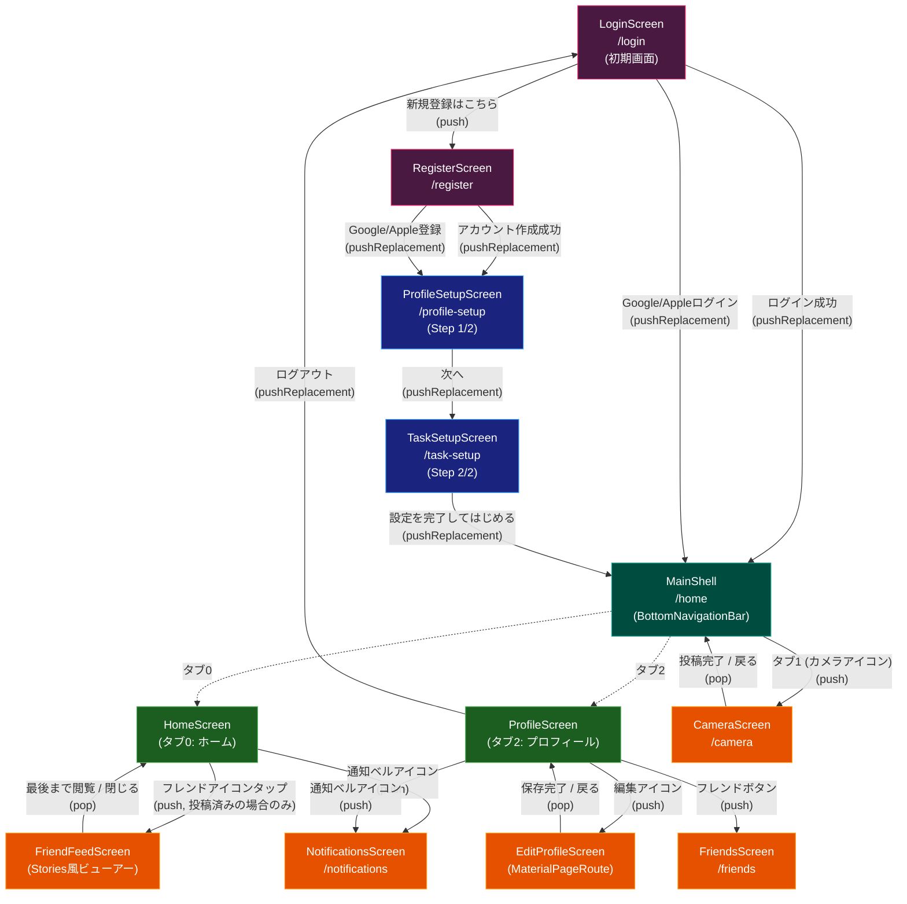

# V EFFECT 画面遷移図

## 画面一覧

| 画面名 | ルート | 説明 |
|--------|--------|------|
| LoginScreen | `/login` | ログイン画面（初期画面） |
| RegisterScreen | `/register` | 新規登録画面 |
| ProfileSetupScreen | `/profile-setup` | プロフィール設定（Step 1/2） |
| TaskSetupScreen | `/task-setup` | タスク設定（Step 2/2） |
| MainShell | `/home` | BottomNavigationBar付きシェル |
| HomeScreen | (タブ0) | ホーム画面（ストリーク・タスク表示） |
| ProfileScreen | (タブ2) | プロフィール表示画面 |
| CameraScreen | `/camera` | 写真撮影・投稿画面 |
| FriendsScreen | `/friends` | フレンド管理画面 |
| NotificationsScreen | `/notifications` | 通知一覧画面 |
| EditProfileScreen | (MaterialPageRoute) | プロフィール編集画面 |
| FriendFeedScreen | (MaterialPageRoute) | フレンド投稿ビューアー（Stories風） |

## 遷移の種類

- **pushReplacement**: 現在の画面を置き換え（戻るボタンなし）
- **push**: 画面をスタックに追加（戻れる）
- **pop**: 前の画面に戻る
